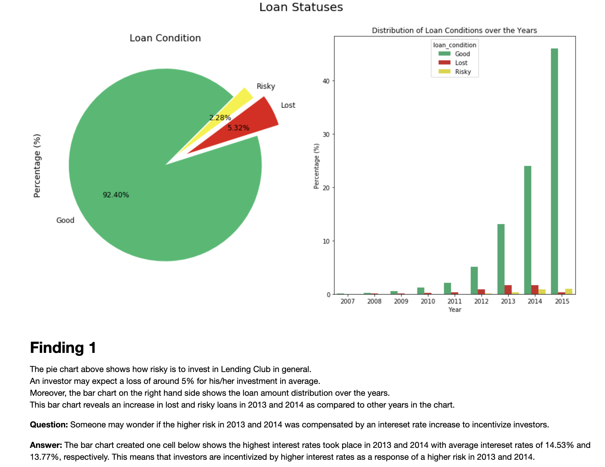
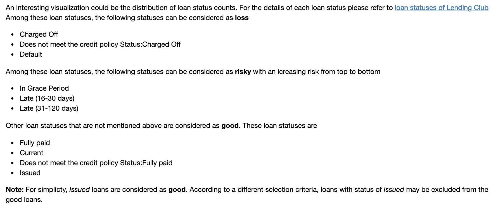
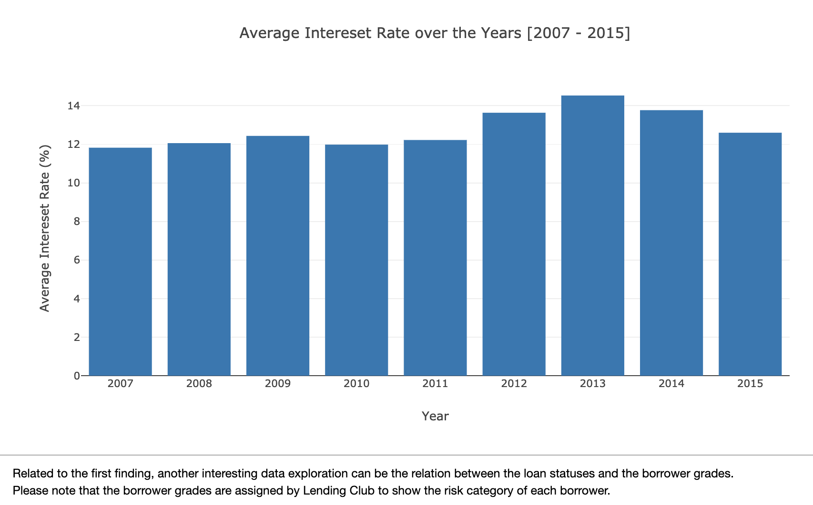
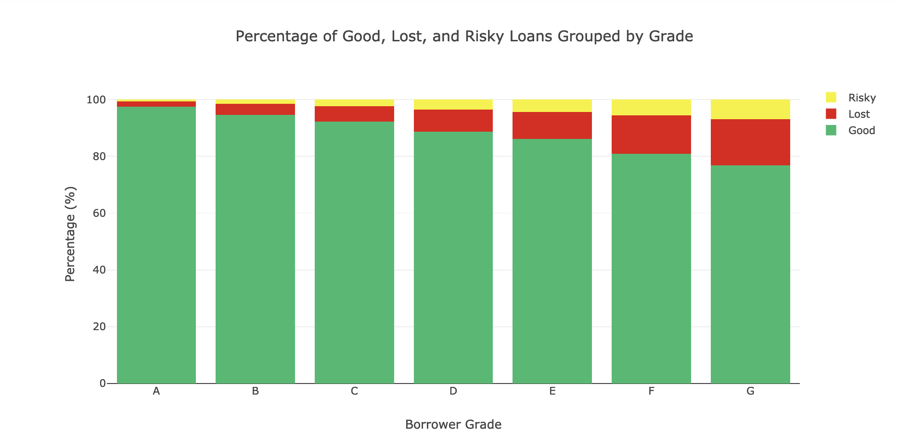
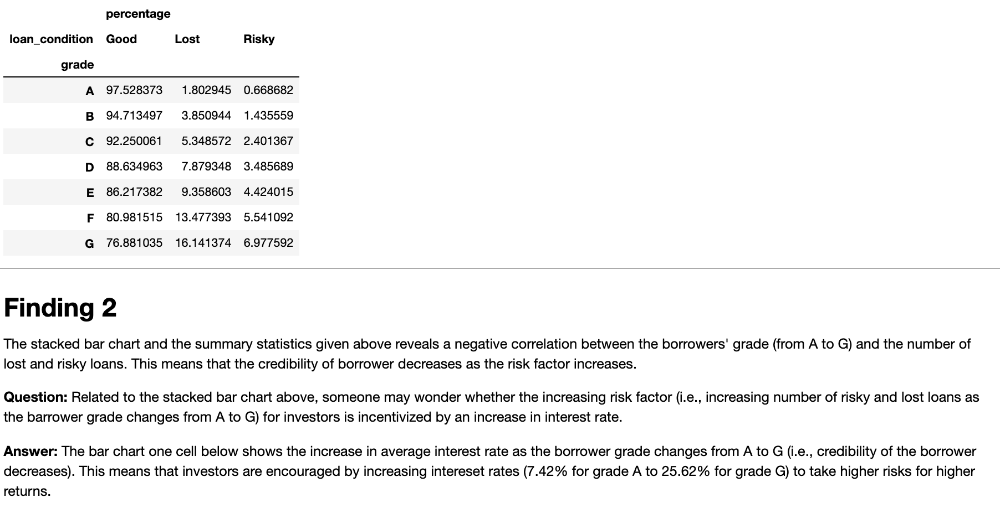
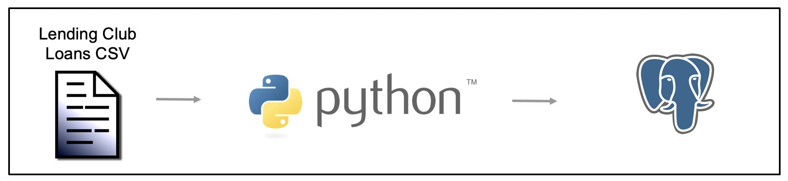

# Lending Club Data Analysis and ETL Project
## Overview

This project provides some useful insights about the Lending Club Loan dataset for data exploration. Moreover, a prototype of a production data pipeline which extracts, transforms (i.e, cleans and validates), and
loads the transformed data in to a database is also provided.

Cleaned and validated data can be used by data scientists and/or analysts to interactively query and explore the data. Data can be also used for machine learning model training and evaluation.

The outline of the project is as follows:

# Outline
1. [About the Lending Club](#about) 
    a.[What is Lending Club](#what_is) 
    b.[Working Principle](#working_principle) 
2. [Dataset](#dataset) 
3. [Findings from Data Analysis](#data_analysis) 
4. [Directory Structure](#directories) 
5. [How to run?](#howtorun) 
6. [Technology](#technology) 
7. [Data Pipeline](#data_pipeline) 
8. [Future Considerations and Improvements](#future) 
    a.[Future Work](#futurework) 
    b.[Possible Improvements](#improvements) 

# About the Lending Club

## What is Lending Club?

LendingClub is a US peer-to-peer lending company, headquartered in San Francisco, California.
It was the first peer-to-peer lender to register its offerings as securities with
the Securities and Exchange Commission, and to offer loan trading on a secondary market. 
Lending Club is the world's largest peer-to-peer lending platform.  
Lending Club enables borrowers to create unsecured personal loans between $1,000 and $40,000. 
The standard loan period is three years.
Investors can search and browse the loan listings on Lending Club website
and select loans that they want to invest in based on the information supplied about the borrower,
amount of loan, loan grade, and loan purpose. Investors make money from interest.
Lending Club makes money by charging borrowers an origination fee and investors a service fee. 
Sources: [Lending Club Wikipedia Page](https://en.wikipedia.org/wiki/Lending_Club),
[Official Lending Club Web Page](https://www.lendingclub.com/) 

## Working Principle of Lending Club

1. Borrowers create an account
2. Investors open an account
3. Borrowers apply for loans and wait for approval
3. Borrowers get credit check
4. Borrowers get funded if they meet certain criteria, such as
    * Minimum credit score of 600
    * Minimum credit history of 3 years
    * Debt-to-income ratio of less than 40% for single applications, 35% for joint applicants
5. Investors build a portfolio that may consist of multiple notes (each portion of a loan is called a note that is worth of $25)
6. Investors earn from the interest borrowers pay
7. Investors may reinvest

__Side Note:__ LendingClub provides grades for borrowers, which assigns a grade to every approved borrower using credit and income data. Your grade determines what range of interest rates you qualify for and helps investors decide whether to fund your loan. Borrowers can’t see their grades; only investors can.

Below is the web interface of the Lending Club seen by an investor.  

 
Source: [Lending Club Review](https://www.lendacademy.com/lending-club-review/)

# Dataset

The Lending Club Loan dataset ([Lending Club Loan Dataset](https://www.kaggle.com/wendykan/lending-club-loan-data)) has 74 columns. 
These columns are described in the dictionary provided by Kaggle ([Lending Club Loan Dataset Dictionary](https://www.kaggle.com/wendykan/lending-club-loan-data#LCDataDictionary.xlsx)). 
The first 10 rows of the dataset, some basic statistics, such as count, min, max, mean, standard deviation, and quantiles, of the columns with numeric values, and the loan dictionary are shown below for better understanding of each column.

# Findings from Data Analysis

A data analysis for Lending Club Loans dataset can be found in the __analysis__ folder as a jupyter notebook file. The high-level finding of this analysis are provided as follow:

# Directory Structure

1. __src__ folder includes __app.py__ and __configuration.py__ scripts, and __db__, __etl__, and __logger__ subfolders
  * The entry point of the application is __app.py__ script. When you run __run.sh__ shell script this is the first script that runs

  * __configuration.py__ script stores the configuration used for database and logging operations

  * __db__ folder contains
    * __base_metadata_service.py__ script to be the base class of the database module

    * __sql_metadata_service.py__ is the main database module that inherits the base metadata service and implements the necessary database operations, such as creating a SQLAlchemy engine and storing the cleaned data to database

  * __etl__ folder contains
    * __ETL.py__ script that performs data cleaning and validation operations.

  * __logger__ folder contains
    * __logger.py__ script for logging operations

2. __analysis__ folder includes the jupyter notebook, __data_analysis_lending_club.ipynb__ that performs data analysis for data exploration.

3. __logs__ folder stores log files

4. __images__ folder includes images to be shown in the markdown readme document.

# How to Run?

Please use __run.sh__ shell script in the main folder to run the project.

# Technology

The project uses Python 3.7.2, Pandas 0.24.1, SQLAlchemy 1.3.0, and PostgresSQL 11.2.

# Data Pipeline

The data pipeline accepts a csv file that contains raw data to be cleaned and validated as the input.

 Python programming language is used to perform data cleaning and validation.

 Processed data is stored in PostgresSQL.

 The overview of the data pipeline is visualized in the following figure

The data is first read from the input **csv** file and loaded into a Pandas data frame. Since the original raw data may contain incomplete and non-validated data, Python is used for data cleaning, completion, and validation. The results are then stored in PostgresSQL.

# Future Considerations and Improvement

## Future Work

Test cases have not been implemented. Test modules will be implemented.
In addition to the existing data validation in the project, data validation tools, such as Valideer (https://github.com/podio/valideer), Cerberus (http://docs.python-cerberus.org/en/stable/), or Voluptuous (https://github.com/alecthomas/voluptuous), can be also used.

## Possible Improvements

Pandas' __to_sql__ method that loads the data frame to the database table is the bottleneck of the project. This process takes around 10 - 15 mins.

Possible alternative approaches to mitigate the mentioned bottleneck may be to use __pd.io__ library or PostgresSQL's __COPY__ command, or ready-to-use libraries, such as __odo__ (http://odo.pydata.org/en/latest/perf.html).

PostgresSQL's __COPY__ function can be used if the cleaned data is temporarily stored in a csv file. This csv file can be then loaded into database with a matching schema provided in the csv file.
